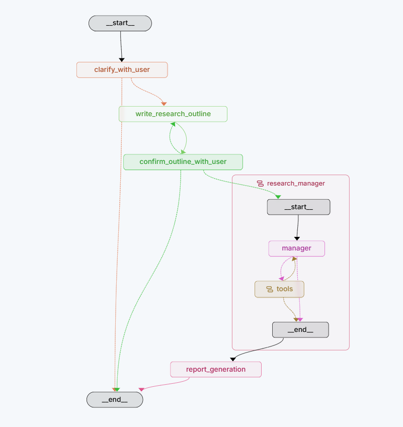

# Deep-Research-Assistant 项目方案

> GitHub 项目名称：`Deep-Research-Assistant`  
> 参赛任务：犀牛鸟开源 - 实战任务一“开放式场景：AI 应用与评判标准设计”

## 1. 设计思路

Deep-Research-Assistant 是一个基于 Hy3、LangGraph 和多来源检索工具构建的通用深度研究智能体，面向科技、商业、政策、产品和学术等需要资料调研与报告生成的真实场景。用户输入自然语言研究需求后，系统不直接生成结论，而是先完成需求澄清、研究大纲确认、多维资料检索、证据整理和报告综合，最终输出可阅读、可追溯的 Markdown 调研报告。

整体设计遵循以下思路：

1. **先规划，后研究。** 系统先判断用户需求是否存在会影响研究方向的关键歧义；必要时发起一次澄清，再生成研究简报和报告大纲，交由用户确认或修改后再开始检索。
2. **拆分复杂问题，并行获取证据。** 由研究统筹智能体将任务拆分为多个边界清晰的子问题，多个研究员并行完成资料检索与分析，提高复杂课题的覆盖广度和效率。
3. **以证据驱动报告生成。** 研究员从论文、网页和可扩展的 MCP 工具中提取信息，整理为证据备忘录；最终报告基于已有证据综合生成，避免只依靠模型内部知识回答。
4. **兼顾质量、成本与稳定性。** 对并发研究单元、模型调用次数、工具结果长度和循环次数设置上限；当部分工具失败或预算耗尽时，系统保留已有证据并降级完成报告。
5. **支持持续交互。** 研究过程通过后台任务执行，用户可以在澄清和大纲确认节点介入；报告完成后还能围绕已有报告继续追问，不必重复执行完整检索流程。

研究流程如下：

```text
用户需求
  → 需求澄清
  → 研究简报与大纲生成
  → 用户确认大纲
  → Manager 拆分研究任务
  → 多个 Researcher 并行检索、反思与压缩证据
  → 基于证据生成 Markdown 报告
  → 报告保存与后续追问
```

## 2. 系统架构

系统采用“Web 交互层 - 工作流编排层 - 模型与工具层 - 数据与观测层”的分层架构。



*图 1 Deep-Research-Assistant 核心工作流。任务依次经过需求澄清、研究大纲生成与确认，并进入 `research_manager` 子图；其中 `manager` 在工具调用循环中完成研究任务统筹，最后交由 `report_generation` 输出报告。*

| 层级 | 核心组件 | 主要职责 |
| --- | --- | --- |
| Web 交互层 | FastAPI、HTML/CSS/JavaScript | 管理会话、提交研究请求、通过 SSE 展示结构化过程和报告增量、处理用户确认信息 |
| 工作流编排层 | LangGraph 主图、Manager、Researcher | 控制澄清、暂停恢复、任务拆分、并行研究和最终报告生成 |
| 模型与工具层 | Hy3、OpenAlex、Tavily、MCP | 负责结构化规划、模型推理、学术检索、网页检索和外部数据扩展 |
| 数据与观测层 | SQLAlchemy、SQLite/PostgreSQL、LangSmith | 持久化会话、消息和报告产物，记录运行过程并支持质量分析 |

其中，LangGraph Server 负责后台 Thread/Run 的执行和 checkpoint 保存；应用数据库负责保存会话、消息、结构化过程事件、记忆和 Markdown 报告。页面使用 SSE 接收过程事件和正在生成的报告，断线后按事件 ID 续传，并保留轮询作为降级路径。二者分离后，即使网页请求结束，研究任务仍可继续执行。

## 3. 重点技术

### 3.1 LangGraph 多智能体工作流

项目使用 LangGraph 构建主图和子图。主图负责澄清需求、生成大纲、等待用户确认、调度研究和生成最终报告；Manager 负责根据研究简报判断需要补充的证据，并将任务分发给多个 Researcher；Researcher 则通过“检索 - 反思 - 再检索 - 压缩”的循环完成一个独立研究单元。

该设计使系统可以针对不同领域动态制定研究路径，而不是依赖固定的论文检索流水线。

### 3.2 并行研究与异步执行

Manager 一次可以委派多个独立子任务，系统通过 `asyncio.gather` 并发运行多个 Researcher。研究单元数量由配置项限制，默认最大并发数为 5。这样可以同时覆盖背景、技术路线、市场现状、政策影响和风险等多个研究维度，降低串行检索的等待时间。

### 3.3 多源信息检索与 MCP 扩展

- **OpenAlex**：用于检索论文元数据、摘要和可获取的全文，适合学术研究和技术证据收集。
- **Tavily**：用于公开网页、新闻、政策、产品和行业资料检索。系统对 URL 去重、按相关性筛选，并只总结高相关网页以控制上下文长度。
- **MCP**：通过动态发现机制接入内部知识库、业务系统或专业服务。新增数据源时无需改动工作流主代码。

所有来源都会保留提供方、标题、URL、原生记录标识、发布时间和证据等级等信息，为报告的可追溯性提供基础。

### 3.4 结构化输出与用户确认机制

系统通过 Pydantic 定义澄清决策、研究简报、研究大纲和任务委派等数据结构，并采用 JSON Schema 约束模型输出。用户可在 LangGraph `interrupt` 节点确认或修改大纲，系统随后从断点继续执行。这避免了复杂研究任务因初始理解偏差而整体跑偏。

### 3.5 上下文压缩与调用预算控制

网页原文、论文全文和多轮工具结果可能导致上下文迅速膨胀。项目对单次工具结果、研究员上下文和最终报告上下文分别设置长度限制，并将每位研究员的结果压缩成证据备忘录。

同时，`Hy3CallBudgetManager` 继续记录单个研究任务的总调用数与分阶段调用数，但默认不启用全局硬次数上限。流程改由 Manager 轮数、Researcher ReAct 轮数、单研究员搜索次数、并发数和重试次数共同约束，避免因为网页摘要占用统一额度而使关键补缺研究无法执行。部署方仍可通过正整数配置显式恢复全局硬预算；启用后继续保护最终复核、报告和研究单元压缩调用。

### 3.6 持久化、报告追问与可观测性

项目默认使用 SQLite 保存会话、消息、会话摘要和研究报告，也支持切换 PostgreSQL。报告生成后以 Markdown artifact 保存；后续追问会结合报告正文、近期对话和滚动摘要生成回答。

项目支持 LangSmith Trace，可记录节点、工具和研究单元的执行过程，用于定位工具失败、耗时瓶颈和模型调用消耗，为后续优化提供依据。

## 4. 预期效果

1. **提升调研效率。** 将资料搜集、提纲整理、观点归纳和报告初稿生成整合为一个连续流程，减少在多个检索平台之间反复切换的时间。
2. **提高研究覆盖度。** 通过 Manager 拆解问题、Researcher 并行调研，使复杂问题能够从多个维度同时获取资料和证据。
3. **增强报告可追溯性。** 报告生成过程保留论文、网页或 MCP 记录的来源信息，便于用户复核核心结论和继续深入研究。
4. **改善交互体验。** 用户可以在研究前确认大纲，在研究后围绕报告追问；后台运行机制避免长任务受页面刷新或请求超时影响。
5. **保证系统可扩展性。** 新增领域数据源可通过 MCP 接入，模型、并发、预算和工具策略均可通过配置调整。
6. **控制运行成本与风险。** 通过并发上限、循环上限、上下文截断、网页缓存和模型调用预算，减少重复检索与无效调用，并在异常情况下保留已有成果。

## 5. 时间规划

项目当前已完成可运行的基础版本，以下为后续 6 周完善计划：

| 阶段 | 时间 | 工作内容 | 预期产出 |
| --- | --- | --- | --- |
| 第一阶段：基础功能固化 | 第 1 周 | 完善环境配置、运行文档和典型任务流程；执行静态检查、单元测试和端到端冒烟测试 | 可复现的运行环境、基础测试报告、演示流程 |
| 第二阶段：研究质量优化 | 第 2 周 | 优化需求澄清、研究大纲、任务拆分和报告生成提示词 | 更稳定的研究大纲和报告输出效果 |
| 第三阶段：多源检索优化 | 第 3 周 | 调整 OpenAlex 与 Tavily 的检索、去重、排序和内容压缩策略；补充 MCP 接入示例 | 更丰富、相关且更易追溯的资料来源 |
| 第四阶段：评估与调优 | 第 4 周 | 构建典型研究任务集，分析报告的覆盖度、来源质量和可读性；依据结果迭代策略 | 评测记录、典型案例和优化结果 |
| 第五阶段：稳定性与部署验证 | 第 5 周 | 验证任务中断恢复、超时、工具失败、预算耗尽和并发执行等场景；完善 PostgreSQL 部署方案 | 稳定性测试报告、部署说明 |
| 第六阶段：成果整理与展示 | 第 6 周 | 完善 README、项目文档与示例；录制不超过 2 分钟的 Demo 视频或 GIF | 完整开源仓库、方案文档、演示材料 |
